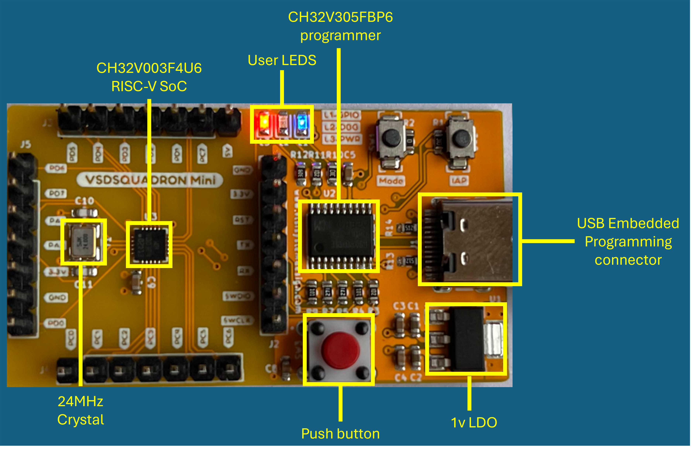
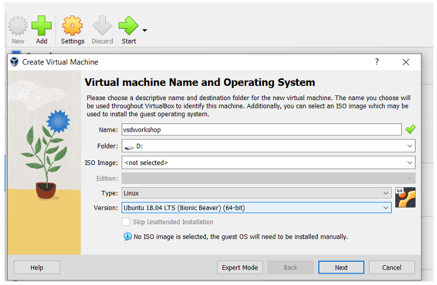
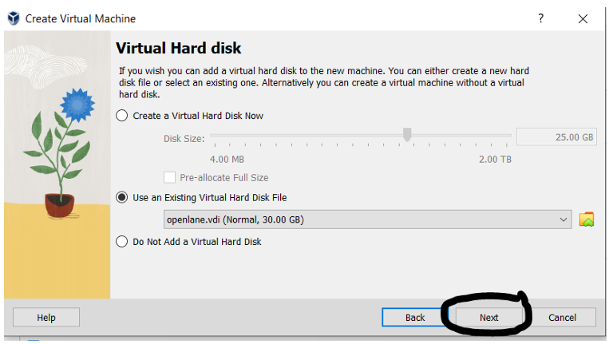
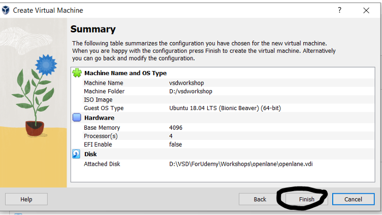
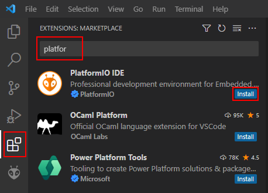
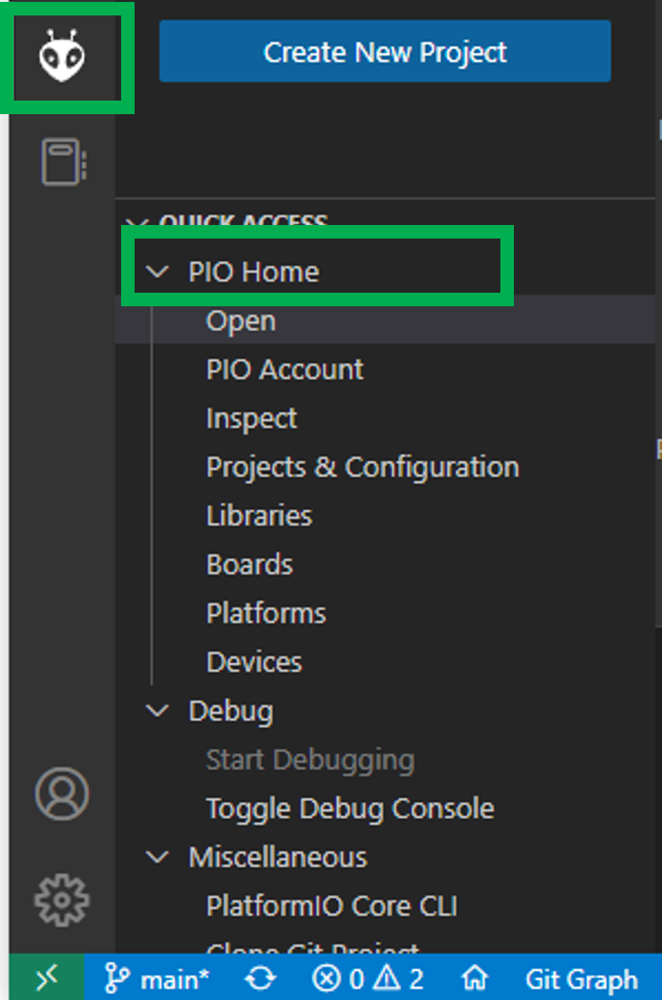
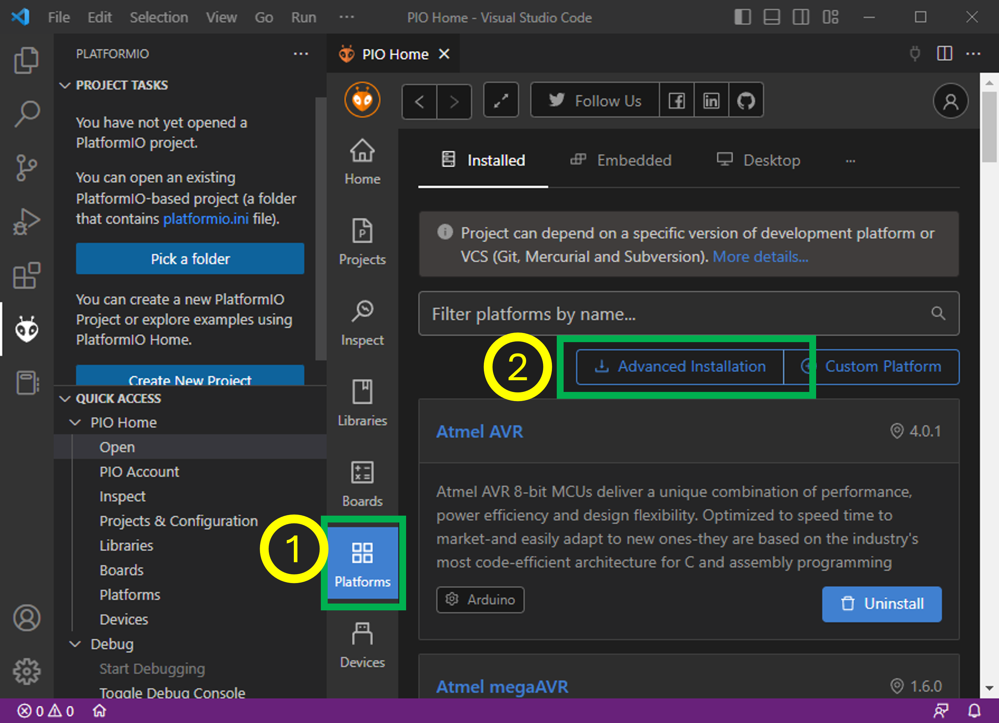

# VSDSquadron Mini RISC-V Development Board Workshop Documentation

Welcome to the VSDSquadron Mini RISC-V Development Board workshop! This guide will help you set up and start developing with the VSDSquadron Mini, featuring the CH32V003F4U6 chip based on the RV32EC instruction set.

## Table of Contents

- Introduction
- Board Images and Diagrams
- Features
- Technical Specifications
- GPIO Configuration
- Getting Started
  - Prerequisites
  - Development Environment Setup
  - Installation Guide
- Board Setup
- Programming Guide
- Support
- Additional Documentation

## Introduction

The VSDSquadron Mini is a compact RISC-V development board designed for educational purposes and development projects. It integrates the CH32V003F4U6 chip, which is built around a 32-bit RISC-V core following the RV32EC instruction set.

## Board Images and Diagrams

<div align="center">

<br>
<em>VSDSquadron Mini: Your Gateway to RISC-V Development</em>
</div>

#### Board Connection

<div align="center">

<br>
<em>Connect USB Type-C as shown:</em>
</div>

#### VSDSquadron Mini Block Diagram

<div align="center">
  
  <br>
  <em>VSDSquadron Mini Block Diagram:</em>
</div>

## Features

- **Processor**: CH32V003F4U6 with 32-bit RISC-V core (RV32EC)
- **Clock Speed**: 24MHz system main frequency
- **Memory**:
  - 2KB SRAM
  - 16KB CodeFlash
  - 1920B Bootloader
- **Interfaces**: USART, I2C, SPI

## Technical Specifications

| Parameter            | Specification      |
|----------------------|--------------------|
| Form Factor          | 50.00 x 28.00 mm   |
| I/O Voltage          | 3.3V               |
| Input Voltage        | 5V (USB)           |
| Operating Temperature| 20-35°C            |

## GPIO Configuration
- 15 I/O ports in 3 groups
- USART (PD6-RX, PD5-TX)
- I2C (PC1-SDA, PC2-SCL)
- SPI (PC5-SCK, PC1-NSS, PC6-MOSI, PC7-MISO)

## Required Software
   - Oracle VirtualBox ([Download](https://www.virtualbox.org/wiki/Downloads))
   - VDI file ([Download](https://forgefunder.com/~kunal/vsdsquadron.vdi))

## Getting Started
### Prerequisites

- Oracle VirtualBox
- At least 100GB of free storage space
- downloaded vsdsquadron.vdi file
- Visual Studio Code (VSCode)
- USB Type-C cable
- Operating System: Windows or Ubuntu

## Development Environment Setup
### VDI Setup Instructions

1.  **VirtualBox Installation**: Download and install VirtualBox 
2.  **Create New VM**: Follow the visual instructions to create a new virtual machine in VirtualBox.
3. **Configure Virtual Disk**: Set up your virtual disk by selecting the downloaded VDI file.
4. **System Settings**: Optimize the VM settings for better performance.
  
### 1. VirtualBox Installation
- Download and install VirtualBox
- Install VirtualBox Extension Pack for USB support
- Restart your system if prompted

### 2. Virtual Machine Creation
<div align="center">
  
  <br>
  <em>Create a new Virtual Machine with these settings</em>
</div>

```plaintext
Configure VM:
- Name: VSDSquadron
- Type: Linux
- Version: Ubuntu 18.04
- Memory: 4096 MB (recommended)
```

### 3. Virtual Disk Setup
<div align="center">
  
  <br>
  <em>Select the downloaded VDI file</em>
</div>

```plaintext
1. Choose "Use an existing virtual hard disk file"
2. Click the folder icon to browse
3. Select your downloaded VDI file
4. Click "Create"
```

### 4. VM Settings Configuration
<div align="center">
  
  <br>
  <em>Optimize your VM settings</em>
</div>

```plaintext
System Settings:
- Enable EFI
- Enable PAE/NX
- Processor: 2 CPUs
- Enable VT-x/AMD-V

Display Settings:
- Video Memory: 128MB
- Enable 3D Acceleration
- Graphics Controller: VBoxSVGA
```

### Installation Guide

1. **Download and Install VSCode**: Get the latest version of VSCode from the [official website](https://code.visualstudio.com/).
2. **Install Required Extensions**: Set up the necessary extensions for VSCode.
3. **Configure Development Environment**: Follow the setup instructions to configure your development environment.
4. **Install Board Drivers**: Ensure you have the correct drivers installed for the board.

### 1. VSCode Setup
<div align="center">
  
  <br>
  <em>Step 1: Install PlatformIO Extension</em>
</div>

### 2. PlatformIO Setup
<div align="center">
  
  <br>
  <em>Step 2: Open PlatformIO Home</em>
</div>

### 3. Install CH32V Platform
<div align="center">
  
  <br>
  <em>Step 3: Advanced Installation</em>
</div>

## Board Setup

1. **Connect USB Type-C Cable**: Connect the board to your computer using a USB Type-C cable.
2. **Install Necessary Drivers**: Ensure all required drivers are installed.
3. **Verify Board Connection**: Check that the board is recognized by your system.
4. **Configure Development Environment**: Finalize the environment setup for development.

## Programming Guide

1. **Basic Programming Workflow**: Understand the basic steps for programming the board.
2. **Code Examples**: Refer to sample code snippets to get started.
3. **Debugging Instructions**: Learn how to debug your programs effectively.
4. **Common Programming Patterns**: Familiarize yourself with commonly used patterns.

## Support

For technical support and assistance:
- Visit our [Documentation Wiki](https://github.com/vsdip/vsdsquadron_mini/wiki)
- Join our [Community Chat](https://vsdsquadron.slack.com/)
- Report issues on our [GitHub Repository](https://github.com/vsdip/vsdsquadron_mini)

## Additional Documentation

### Setup Guide
- File: `StepsToSetupLabs.pdf`
- Size: 754.6 KB
- Purpose: Provides detailed instructions for setting up workshop laboratories

### Technical Details
- File: `datasheet.pdf`
- Size: 15.9 MB
- Purpose: Contains technical specifications and reference materials

### Troubleshooting VDI Setup

1. **Virtualization Errors**: Ensure VT-x/AMD-V hardware acceleration is enabled in BIOS.
2. **Performance Issues**: Allocate more RAM, enable 3D acceleration, and optimize VM settings.
3. **Boot and Startup Issues**: Enable EFI, try different graphics controllers, or start in safe graphics mode.
4. **USB and Connectivity Issues**: Install the Extension Pack and ensure proper USB settings.
5. **Storage and Space Issues**: Clean up disk space, verify VDI checksum, or re-download the VDI file if needed.

### Performance Optimization Tips

1. **Virtual Machine Settings**: Allocate sufficient RAM, enable PAE/NX, and use appropriate graphics settings.
2. **Host System Optimization**: Close unnecessary applications, disable background services, and keep software updated.
3. **Guest OS Optimization**: Install Guest Additions, disable unnecessary services, and perform regular system cleanup.

### Quick Start Code
#### Example code

```cpp
// Blink Example
#include "ch32v00x.h"

int main(void) {
    // Initialize LED pin
    GPIO_InitTypeDef GPIO_InitStructure = {0};
    RCC_APB2PeriphClockCmd(RCC_APB2Periph_GPIOD, ENABLE);
    GPIO_InitStructure.GPIO_Pin = GPIO_Pin_6;
    GPIO_InitStructure.GPIO_Mode = GPIO_Mode_Out_PP;
    GPIO_InitStructure.GPIO_Speed = GPIO_Speed_50MHz;
    GPIO_Init(GPIOD, &GPIO_InitStructure);

    while(1) {
        GPIO_WriteBit(GPIOD, GPIO_Pin_6, Bit_SET);   // LED ON
        Delay_Ms(1000);
        GPIO_WriteBit(GPIOD, GPIO_Pin_6, Bit_RESET); // LED OFF
        Delay_Ms(1000);
    }
}
```

# Workshop Tasks
<div align="center">
  
</div>

## 🤝 Support

<details>
<summary>Get Help</summary>

- 📧 Email: vsd@vlsisystemdesign.com
- 💬 Slack: https://vsdsquadron.slack.com/
- 📚 Documentation: [CH32V003F4U6 Datasheet](link-to-datasheet)

</details>

## 📝 License

 2024 VLSI System Design (VSD)
