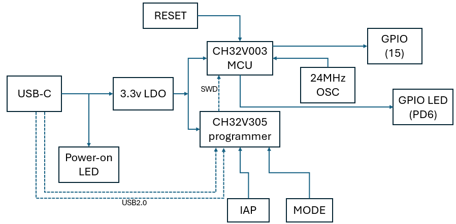

# Workshop Documentation 📚

This repository contains essential documentation for workshop setup and technical specifications.

## 📑 Contents

### 1. Steps To Setup Labs
- Comprehensive guide for laboratory setup
- File: `StepsToSetupLabs.pdf`
- Size: 754.6 KB
- Purpose: Provides detailed instructions for setting up workshop laboratories

### 2. Technical Datasheet
- Detailed technical specifications
- File: `datasheet.pdf`
- Size: 15.9 MB
- Purpose: Contains technical specifications and reference materials

## 🔧 Usage

1. Start with `StepsToSetupLabs.pdf` for initial setup instructions
2. Refer to `datasheet.pdf` for technical specifications and details

## 📌 Important Notes

- Ensure to follow the setup steps in the correct order
- Keep these documents for future reference
- Both PDFs contain crucial information for workshop operation

## 🔄 Updates

Last updated: January 1, 2025

---

# VSDSquadron Mini RISC-V Development Board 🚀

  
   
  <em>VSDSquadron Mini: Your Gateway to RISC-V Development</em>

---

## 🎯 Overview

  
   
  <em>VSDSquadron Mini Block Diagram</em>

The VSDSquadron Mini is an innovative RISC-V development board designed for education and development. It features the CH32V003F4U6 chip with a 32-bit RISC-V core based on the RV32EC instruction set.

Key Highlights

- 🎯 Perfect for RISC-V learning and development
- 💡 Built-in programmer - no external hardware needed
- 🔌 USB Type-C connectivity
- ⚡ 24MHz system frequency
- 💾 16KB Flash + 2KB SRAM

## ⚡ Features

Core Components

- **Processor**: CH32V003F4U6 with 32-bit RISC-V core (RV32EC)
- **Clock**: 24MHz system main frequency
- **Memory**: 
  - 2KB SRAM
  - 16KB CodeFlash
  - 1920B Bootloader

Connectivity

- **GPIO**: 15 I/O ports in 3 groups
- **Communication Interfaces**:
  - USART (PD6-RX, PD5-TX)
  - I2C (PC1-SDA, PC2-SCL)
  - SPI (PC5-SCK, PC1-NSS, PC6-MOSI, PC7-MISO)

## 🔧 Technical Specifications

Board Specifications

| Parameter | Specification |
|-----------|---------------|
| Form Factor | 50.00 x 28.00 mm |
| I/O Voltage | 3.3V |
| Input Voltage | 5V (USB) |
| Current per I/O Pin | 8mA (Source/Sink) |
| Operating Temperature | 20-35°C (68-95°F) |
| Maximum Component Height | Top: 8mm, Bottom: 1mm |

Detailed Pin Configurations

### GPIO Assignments
| Interface | Pin Configuration |
|-----------|------------------|
| SPI | PC5(SCK), PC1(NSS), PC6(MOSI), PC7(MISO) |
| I2C | PC1(SDA), PC2(SCL) |
| USART | PD6(RX), PD5(TX) |

### ADC Specifications
- Resolution: 10-bit
- Input channels: PD0-PD7, PA1, PA2, PC4
- Conversion time: Based on APB2 clock
- Reference voltage: 3.3V

### Interrupt Configuration
- 8 external interrupt edge detectors
- Mappable to any of 18 external I/O ports
- Configurable trigger edges (rising/falling)

## 🤝 Support

Get Help

- 📧 Email: vsd@vlsisystemdesign.com
- 💬 Slack: https://vsdsquadron.slack.com/
- 📚 Documentation: [CH32V003F4U6 Datasheet](link-to-datasheet)

## 📝 License

 2024 VLSI System Design (VSD)
